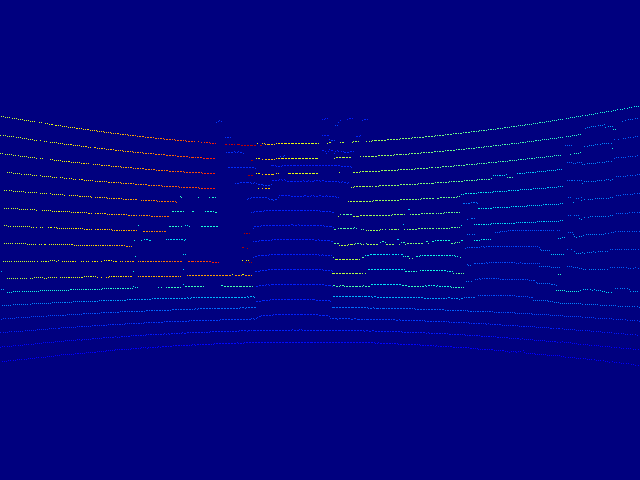

# Fill depth colorization

## Fill empty depth regions using colorization
Reference: Anat Levin's colorization code

See: www.cs.huji.ac.il/~yweiss/Colorization/

author : Hyungtae Lim (shapelim@kaist.ac.kr)  

  
### Explanation

This code is for generating full depth using sparse depth and RGB image. 

sa0331_0.csv is the sparse depth and it is measured by Velodyne-16 (See visualized_velodyne-16.png)

### Usage

<pre><code>$ python3 main.py</code></pre>

#### Input 

#### Result 

### Consideration

* If you run this code by your own sparse depth and RGB image, then revise **sparse_depth** and **img** on main.py
* It takes some time for optimization
